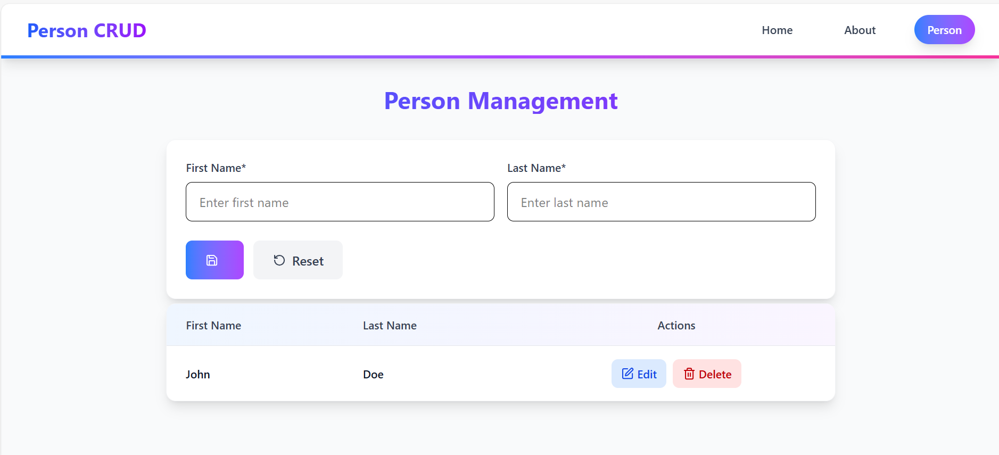

# 📓 Person CRUD (ASP.NET9 Core MVC + React)

A simple Person CRUD web application built with **ASP.NET Core MVC** and **Entity Framework Core**.  
It allows you to **Create**, **Read**, **Update**, and **Delete** people.  
Uses **SQLite** as the database.

**Tutorial Link**:
<a href="https://youtu.be/qcczkv-Hz5c?si=WQkVB18jh7J53d5j" target="_blank">
    Youtube Link
</a>

---

## ✨ Features

- ✅ Add new person
- ✅ View all people
- ✅ Edit existing person
- ✅ Delete a person

---

## 🛠️ Tech Stack

- **Framework:** .NET 9 (Preview)
- **Frontend:** React + TailwindCSS
- **Backend:** ASP.NET Core MVC
- **Database:** SQLite
- **ORM:** Entity Framework Core

---

## 🖥️ Screenshots

### Landing Page

---
